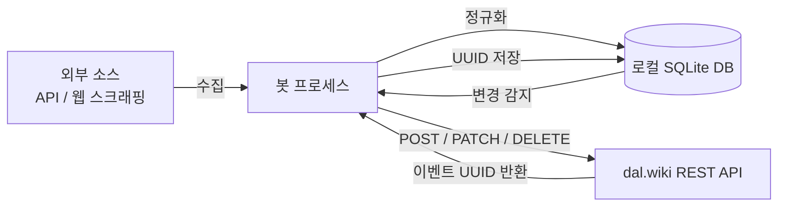

# 시스템 개요

## 목적

dal.wiki는 위키 기반 캘린더 플랫폼이다. 각 봇은 특정 도메인(스포츠, 문화, 엔터테인먼트 등)의 일정을 외부 소스에서 수집하여 dal.wiki의 캘린더 토픽에 이벤트로 자동 등록한다.

운영자가 수동으로 일정을 입력하지 않아도, 봇이 주기적으로 실행되며 신규 이벤트 등록·변경 감지·만료 이벤트 삭제까지 전 주기를 자동화한다.

## 핵심 개념

| 용어 | 정의 |
|------|------|
| **Topic** | dal.wiki 내 캘린더 단위. 고유 UUID로 식별. 봇 하나가 하나 이상의 토픽에 이벤트를 등록한다. |
| **Event** | 캘린더 토픽에 게시되는 단일 일정 항목. UUID로 식별되며 CRUD 가능. |
| **Canonical Key** | 봇 내부에서 이벤트를 유일하게 식별하는 문자열. 로컬 DB와 dal.wiki 이벤트를 연결하는 기준. |
| **Content Hash** | 이벤트 필드 전체를 해시한 값. 값 변경 여부를 감지하는 데 사용. |
| **Dry-Run** | API 호출 없이 로그만 출력하는 테스트 모드. |
| **Backfill** | 과거 날짜 범위를 대상으로 이벤트를 소급 등록하는 작업. |
| **Dual Posting** | 동일 이벤트를 두 개 이상의 토픽에 각각 등록하는 방식. |

## 액터

| 액터 | 역할 |
|------|------|
| **봇 프로세스** | 외부 소스 → 로컬 DB → dal.wiki API 전 과정을 실행. Windows 작업 스케줄러(.bat)가 주기적으로 기동. |
| **외부 소스** | 데이터를 제공하는 제3자 API 또는 웹사이트. 봇마다 다름. |
| **dal.wiki API** | 이벤트 CRUD를 처리하는 REST API (`https://api.dal.wiki`). |
| **운영자** | 토픽 ID 설정, .env 구성, 주기 설정, 예외 상황 대응을 담당하는 사람. |

## 전체 데이터 흐름

## 봇 유형 분류

### Type A — 단순 Sweep 봇
- 외부 소스 전체를 주기적으로 읽어 dal.wiki와 동기화
- 예: KBObot, festivalbot, worldcupbot
- DB가 없거나 얕음; 이벤트 식별은 외부 ID 또는 날짜+이름

### Type B — DB 기반 변경 감지 봇
- 로컬 SQLite에 콘텐츠 해시 저장; 변경분만 PATCH
- 예: runbot, figurebot, laftelbot, onlinegamebot
- Content hash 비교 → NEW / CHANGED / UNCHANGED 분류

### Type C — VOD/라이브 매칭 봇
- 메인 캘린더 이벤트와 외부 VOD 데이터를 매칭하여 append
- 예: chzzkvodbot, aesthervodbot
- 방향이 다름: 메인 캘린더가 "원본"이고 봇이 보조 데이터를 붙임

### Type D — AI 보조 봇
- Claude API를 사용해 비정형 텍스트(보도자료, 뉴스)에서 필드 추출
- 예: convinibot, megasale_bot
- 추출 비용 절감을 위해 사전 필터링 후 AI 호출
