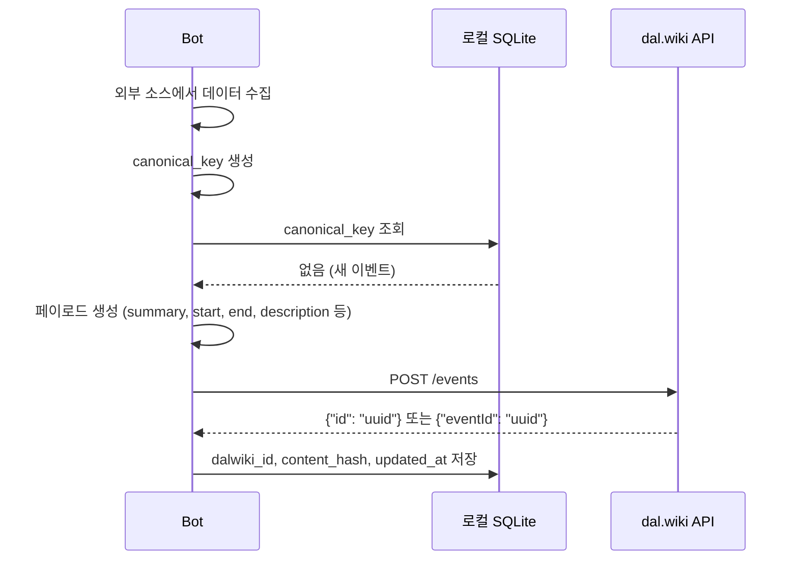

# F01 — 이벤트 등록 (POST)

## 개요

외부 소스에서 수집한 일정을 dal.wiki 캘린더에 최초 등록하는 기능. 전 봇이 공통으로 사용한다.

## 트리거

- 봇 프로세스가 실행됨
- 외부 소스에서 새로운 항목을 수집했고, 해당 항목이 로컬 DB에 없음 (`dalwiki_id IS NULL`)

## 사전 조건

- 대상 토픽 ID가 환경변수에 설정되어 있음
- 외부 소스 응답에서 필수 필드(날짜, 제목)를 추출할 수 있음
- Dry-run 모드가 아님

## 메인 플로우

## 데이터 변환

1. **제목 정규화**: 특수문자 제거, 최대 97자 + "..." 자르기
2. **날짜 변환**: 소스별 형식 → ISO 8601 + `Asia/Seoul` 타임존
3. **allDay 결정**: 시각 정보 없음 또는 하루 종일 이벤트인 경우 `true`
4. **description 생성**: 소스 링크, 장소, 주관자 등을 HTML 단락으로 조합
5. **link 필드**: 소스 URL이 있으면 포함; 없으면 키 자체 생략

## 사후 조건

- `dalwiki_id`가 로컬 DB에 저장됨
- `content_hash`가 저장되어 이후 변경 감지에 사용됨
- dal.wiki 캘린더에 이벤트가 표시됨

## 실패 모드

| 실패 상황 | 대응 |
|---------|------|
| 429 / 5xx | 지수 백오프 후 최대 3회 재시도 |
| 토픽 ID 없음 | 오류 로그 후 해당 이벤트 건너뜀 |
| 응답에 ID 없음 | 경고 로그; `dalwiki_id` NULL 유지 (다음 실행에서 재시도) |
| 필수 필드 누락 | 해당 항목 건너뜀, 다음 항목으로 진행 |

## 요구사항

- **F01-R1**: 새 이벤트는 `POST /events`로 등록한다
- **F01-R2**: 응답에서 이벤트 UUID를 추출하여 로컬 DB에 저장한다
- **F01-R3**: POST 실패 시 `dalwiki_id`를 NULL로 유지하여 다음 실행에서 재시도가 가능하도록 한다
- **F01-R4**: Dry-run 모드에서는 API 호출 없이 로그만 출력하고 가짜 ID를 반환한다
- **F01-R5**: Dry-run 모드에서 가짜 ID를 DB에 저장하지 않는다
