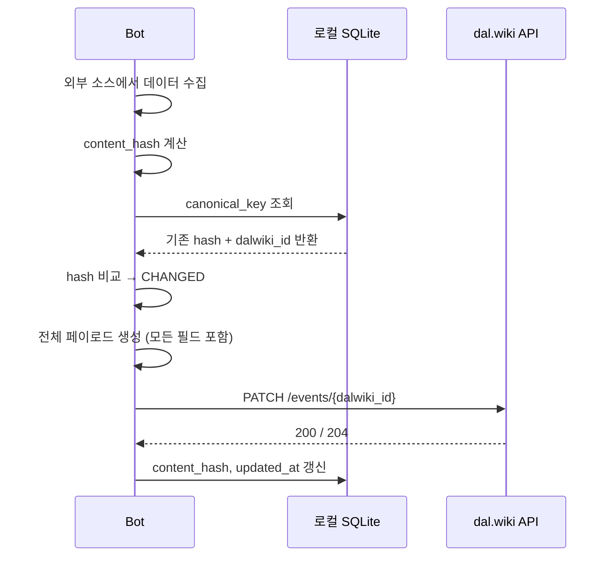

# F02 — 이벤트 변경 감지 및 업데이트 (PATCH)

## 개요

이미 등록된 이벤트의 내용이 외부 소스에서 변경된 경우 dal.wiki에 반영한다. DB 기반(Type B) 봇이 사용한다.

## 트리거

- 봇 프로세스가 실행됨
- 외부 소스에서 수집한 데이터의 content_hash가 DB 저장값과 다름
- `dalwiki_id`가 DB에 존재함

## 메인 플로우



## PATCH 페이로드 규칙

PATCH는 partial update가 아니다. 원래 이벤트에 설정된 모든 필드를 포함해야 한다. 누락된 필드는 서버에서 삭제된다.

```
필수: topicId, summary, start, end, allDay, startTimezone, endTimezone
선택(있으면 포함): description, link, location
```

## 복구 경로

`dalwiki_id`가 NULL인데 content_hash가 있는 경우 (이전 POST 실패):

```
hash 변경 또는 dalwiki_id NULL → POST 시도 → 성공 시 새 UUID 저장
```

## 요구사항

- **F02-R1**: content_hash가 변경된 이벤트만 PATCH한다 (불필요한 API 호출 최소화)
- **F02-R2**: PATCH 페이로드에 모든 필드를 포함한다 (partial update 금지)
- **F02-R3**: PATCH 성공 후 DB의 content_hash와 updated_at을 갱신한다
- **F02-R4**: `dalwiki_id`가 없는 경우 PATCH 대신 POST로 폴백한다
- **F02-R5**: Resync 모드에서는 hash 무관하게 강제 PATCH한다
