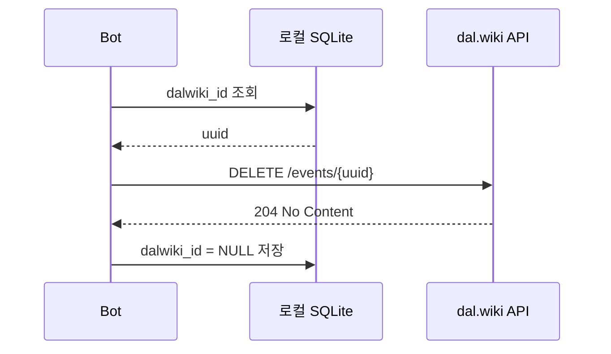

# F03 — 이벤트 삭제 (DELETE)

## 개요

더 이상 유효하지 않은 이벤트를 dal.wiki에서 삭제한다. 봇마다 삭제 정책이 다르다.

## 삭제 트리거 유형

| 트리거 | 사용 봇 |
|--------|---------|
| 소스에서 항목이 사라진 경우 | 일부 봇 (자동) |
| 이벤트 종료일이 지난 경우 | cleanup 모드 봇 |
| 운영자가 명시적 cleanup 실행 | 수동 |

## 메인 플로우

## 재시도 특수 케이스

- 502 응답: 1.5s × 시도 횟수 대기 후 최대 3회 재시도
- 404 응답: 이미 삭제된 것으로 간주, 성공 처리
- 기타 오류: 즉시 실패, dalwiki_id는 유지 (다음 실행에서 재시도)

## Soft Delete vs Hard Delete

일부 봇은 만료된 이벤트를 완전히 삭제하지 않고 PATCH로 상태를 표시한다:
- expire_scanner (laftelbot): description에 "(서비스 종료)" 추가 후 PATCH
- 이유: 사용자가 과거 이력을 조회할 수 있도록

## 요구사항

- **F03-R1**: DELETE 시 항상 로컬 DB의 `dalwiki_id`를 먼저 조회한다
- **F03-R2**: DELETE 성공 후 DB의 `dalwiki_id`를 NULL로 초기화한다
- **F03-R3**: 404 응답은 이미 삭제된 것으로 간주하고 성공 처리한다
- **F03-R4**: 502 응답은 최대 3회 재시도한다
- **F03-R5**: Dry-run 모드에서는 API 호출 없이 로그만 출력한다
