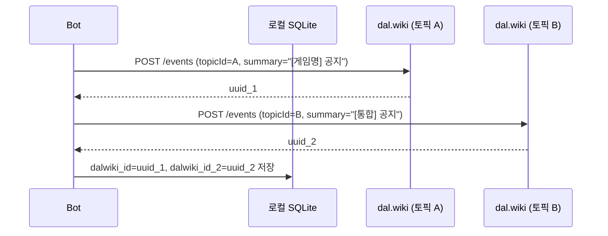

# F04 — 멀티 캘린더 동시 등록 (Dual Posting)

## 개요

동일한 이벤트를 두 개 이상의 dal.wiki 토픽에 각각 등록한다. 개별 캘린더(예: 게임별, 멤버별)와 통합 캘린더를 동시에 운영할 때 사용한다.

**사용 봇**: onlinegamebot (게임별 + 통합), chzzkvodbot (멤버별 + 메인)

## 메인 플로우

## 제목(summary) 차별화

두 캘린더에 올라가는 이벤트는 제목에 prefix가 붙어 구분된다.

| 캘린더 | 제목 패턴 |
|--------|----------|
| 개별 게임 캘린더 | `[리그오브레전드] 패치 14.10 업데이트` |
| 통합 캘린더 | `[LOL] 패치 14.10 업데이트` |
| 개별 멤버 캘린더 | `[아리사] 방송 제목` |
| 메인 통합 캘린더 | 원본 제목 그대로 |

## PATCH / DELETE 처리

변경 또는 삭제 시 두 UUID 모두에 각각 PATCH/DELETE를 보낸다.

## 부분 실패 처리

한 쪽 POST가 성공하고 다른 쪽이 실패한 경우:
- 성공한 UUID는 저장
- 실패한 쪽의 ID는 NULL 유지
- 다음 실행에서 NULL인 쪽만 재시도

## 요구사항

- **F04-R1**: 두 토픽에 각각 독립적으로 POST/PATCH/DELETE한다
- **F04-R2**: 두 UUID를 별도 컬럼으로 로컬 DB에 저장한다
- **F04-R3**: 한 쪽 실패가 다른 쪽 처리를 중단시키지 않는다
- **F04-R4**: 캘린더별로 다른 summary prefix를 사용한다
