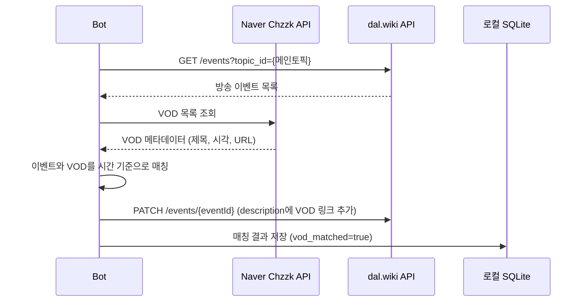

# F05 — VOD 매칭 및 description append

## 개요

dal.wiki 메인 캘린더에 이미 등록된 방송 이벤트에, 치지직 VOD 정보를 자동으로 찾아 description에 추가한다.

**사용 봇**: chzzkvodbot, aesthervodbot

## 특이점

이 기능은 일반 봇과 방향이 반대다:
- 일반 봇: 봇이 이벤트를 생성
- VOD 봇: 사람이 캘린더에 방송 이벤트를 먼저 등록 → 봇이 VOD를 찾아 붙여줌

## 메인 플로우

## 매칭 로직

1. 방송 이벤트의 `start` 시각과 VOD의 `created_at`을 비교
2. 설정된 시간 윈도우(예: ±30분) 이내이면 매칭
3. 멤버별로 채널 ID가 다르므로 채널 ID로 1차 필터 후 시각 비교

## 멱등성 보호

이미 VOD가 붙어 있는 이벤트에는 중복 append하지 않는다:
- DB `vod_matched = true` → 건너뜀
- 또는 description에 이미 VOD 링크 포함 여부 확인

## 사용자 수동 입력 보호 (aesthervodbot)

aesthervodbot의 메인 캘린더는 사용자가 직접 관리하는 항목을 포함한다. 봇이 추가한 description과 사용자 입력 description을 구분하여, 사용자 입력분을 덮어쓰지 않는다.

## 요구사항

- **F05-R1**: 메인 캘린더 이벤트를 먼저 읽어 대상 목록을 확보한다
- **F05-R2**: 시각 기준 매칭으로 방송 이벤트와 VOD를 연결한다
- **F05-R3**: 이미 매칭된 이벤트는 재처리하지 않는다
- **F05-R4**: 사용자가 수동으로 관리하는 description 영역을 보호한다
- **F05-R5**: VOD 링크는 description에 HTML 형식으로 추가한다
