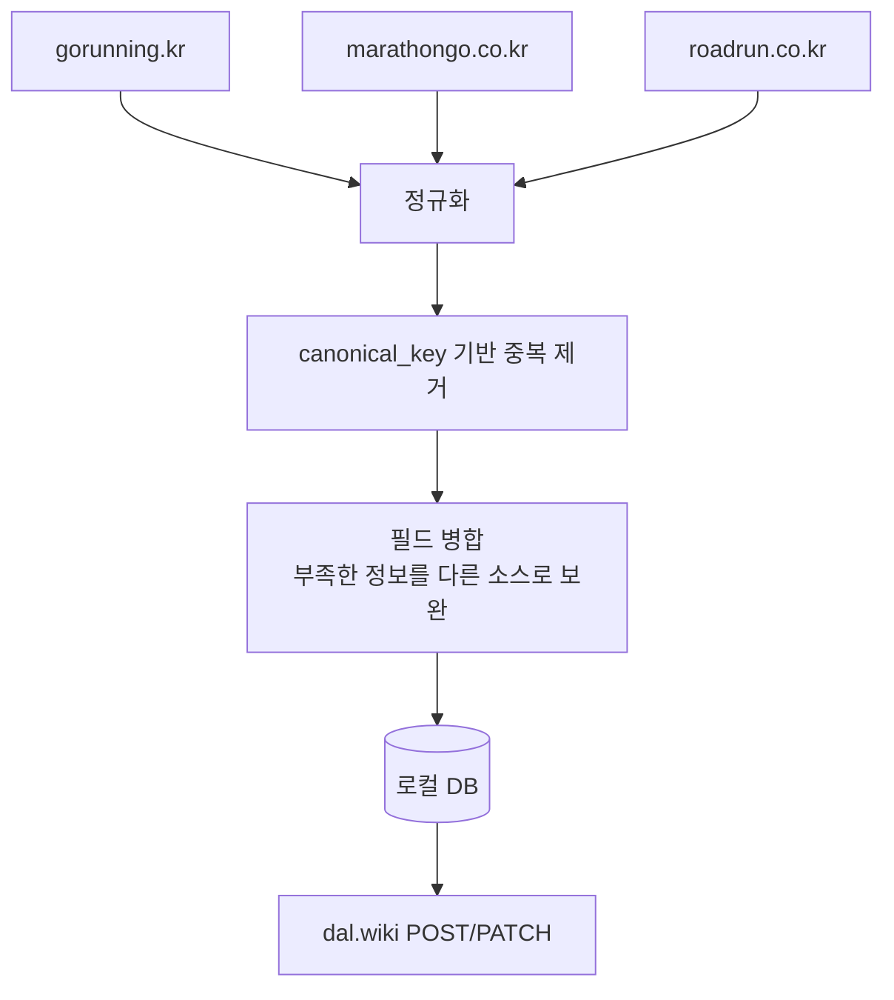

# F08 — 소스 병합 (Multi-source Merge)

## 개요

동일한 도메인을 다루는 여러 외부 소스에서 데이터를 수집하여 중복을 제거하고 하나의 이벤트로 병합한다.

**사용 봇**: runbot (gorunning + marathongo + roadrun 3개 소스)

## 병합 전략



## canonical_key 생성

```
canonical_key = f"{YYYY-MM-DD}_{지역}_{거리버킷}"

예: "2026-05-18_서울_풀"
```

동일 canonical_key를 가진 항목은 같은 대회로 간주한다.

## 필드 병합 규칙

| 필드 | 병합 방식 |
|------|---------|
| 제목 | 소스 우선순위 순으로 첫 번째 비어 있지 않은 값 |
| 장소 | 동일 방식 |
| 신청 URL | 모든 소스의 URL을 `sources` 배열에 저장 |
| 거리 카테고리 | 모든 소스에서 수집된 거리 목록을 합집합 |
| 주관자 | 동일 방식 |

## 소스 추적

병합된 이벤트는 어떤 소스에서 왔는지를 `sources` JSON 배열로 기록한다:

```json
[
  {"source": "gorunning", "url": "https://..."},
  {"source": "marathongo", "url": "https://..."}
]
```

이 정보는 description에 "출처" 섹션으로 표시된다.

## 요구사항

- **F08-R1**: 3개 소스를 각각 독립적으로 수집 후 로컬에서 병합한다
- **F08-R2**: canonical_key가 같은 항목은 하나의 이벤트로 처리한다
- **F08-R3**: 모든 소스 URL을 `sources`에 보존한다
- **F08-R4**: 어느 소스 하나가 실패해도 나머지 소스로 계속 진행한다
