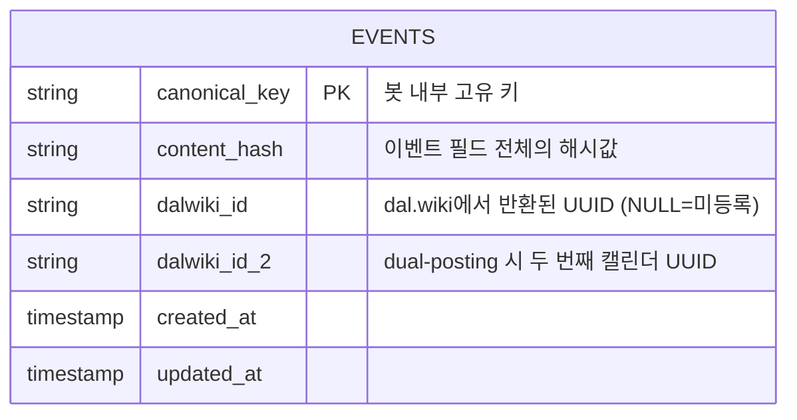
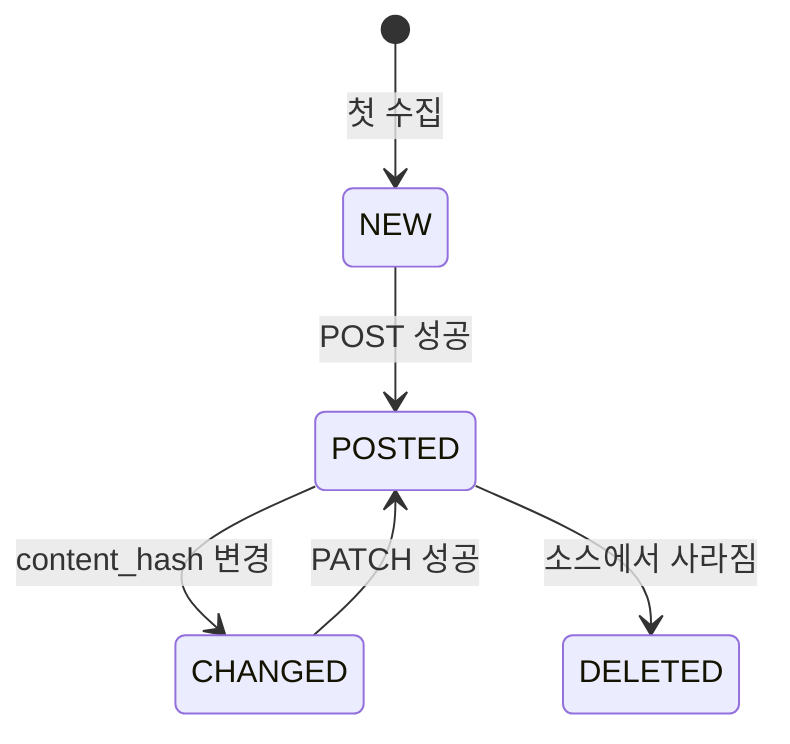
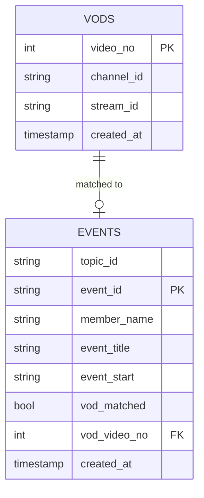

# 데이터 모델

## 공통 SQLite 스키마 패턴

모든 DB 기반 봇은 아래 공통 구조를 따른다. 봇마다 도메인 특화 필드가 추가된다.

---

## 봇별 주요 스키마

### runbot — `merged_races`

마라톤/달리기 대회를 3개 소스에서 병합하여 저장한다.

| 필드 | 타입 | 설명 |
|------|------|------|
| `canonical_key` | TEXT PK | `{날짜}_{지역}_{거리버킷}` 형태 |
| `date` | TEXT | `YYYY-MM-DD` |
| `title` | TEXT | 대회명 |
| `region` | TEXT | 지역 |
| `venue` | TEXT | 장소 |
| `primary_distance_bucket` | TEXT | `풀` / `하프` / `울트라` / `단거리` / `트레일` |
| `categories_normalized` | JSON | 전체 거리 종목 목록 |
| `content_hash` | TEXT | 변경 감지용 해시 |
| `dalwiki_id` | TEXT | dal.wiki 이벤트 UUID |
| `signup_url` | TEXT | 신청 URL |
| `sources` | JSON | 출처 소스 목록 `[{source, url}]` |
| `created_at` | TIMESTAMP | |
| `updated_at` | TIMESTAMP | |

**이벤트 상태 전이**

---

### figurebot — `events`

6개 피규어 제조사 웹사이트에서 발매 일정을 수집한다.

| 필드 | 타입 | 설명 |
|------|------|------|
| `id` | INTEGER PK | |
| `manufacturer` | TEXT | `goodsmile` / `kotobukiya` / `alter` / `flare` / `vertex` / `kaiyodo` |
| `product_name` | TEXT | 제품명 |
| `release_date` | TEXT | `YYYY-MM` 또는 `YYYY-MM-DD` |
| `event_type` | TEXT | `release` / `preorder` |
| `jan_code` | TEXT | JAN 코드 (UNIQUE 식별자) |
| `source_url` | TEXT | 제품 페이지 URL |
| `image_url` | TEXT | 제품 이미지 URL |
| `dalwiki_id` | TEXT | dal.wiki UUID |
| `dalwiki_event_type` | TEXT | `CREATED` / `UPDATED` / `FAILED` |
| `created_at` | TIMESTAMP | |
| `updated_at` | TIMESTAMP | |

**UNIQUE 제약**: `(manufacturer, release_date, product_name)`

**중복 감지 윈도우**: 동일 `release_date` 기준 ±12시간 이내는 같은 제품으로 간주

---

### chzzkvodbot — `vods` + `events`

치지직 VOD와 dal.wiki 캘린더 이벤트를 매칭하여 VOD 정보를 append한다.

---

### laftelbot — `anime_events`

라프텔 스트리밍 콘텐츠의 방영/공개 일정을 저장한다.

| 필드 | 타입 | 설명 |
|------|------|------|
| `id` | INTEGER PK | |
| `laftel_id` | INTEGER | 라프텔 콘텐츠 ID |
| `episode_number` | INTEGER | 에피소드 번호 (NULL = 전편 일괄 공개) |
| `dalwiki_event_id` | TEXT | dal.wiki UUID |
| `airing_at` | TEXT | ISO 8601 (NULL = 날짜만 있는 경우) |
| `release_type` | TEXT | `TV_WEEKLY` / `NETFLIX_DROP` / `BATCH` |
| `title` | TEXT | 콘텐츠 제목 |
| `streaming_sites` | JSON | `[(사이트명, URL)]` |
| `created_at` | TIMESTAMP | |
| `updated_at` | TIMESTAMP | |

---

### onlinegamebot — dual-posting 구조

게임별 캘린더와 통합 캘린더, 두 곳에 동시 등록한다.

| 필드 | 설명 |
|------|------|
| `dalwiki_id_game` | 게임별 캘린더에 등록된 UUID |
| `dalwiki_id_unified` | 통합 캘린더에 등록된 UUID |

두 ID 모두 저장되며, PATCH/DELETE 시 양쪽에 각각 적용한다.

---

## 공통 필드 규칙

| 규칙 | 설명 |
|------|------|
| `dalwiki_id` NULL | 아직 dal.wiki에 등록되지 않은 상태 |
| `content_hash` | SHA-256 또는 MD5; 구현마다 다르나 동일 봇 내에서 일관성 유지 |
| `canonical_key` | POST 실패 시에도 DB에 기록; 다음 실행에서 재시도 |
| `updated_at` | PATCH 성공 후 갱신 |
| JSON 필드 | Python `json.dumps()` 직렬화 문자열로 저장 |
